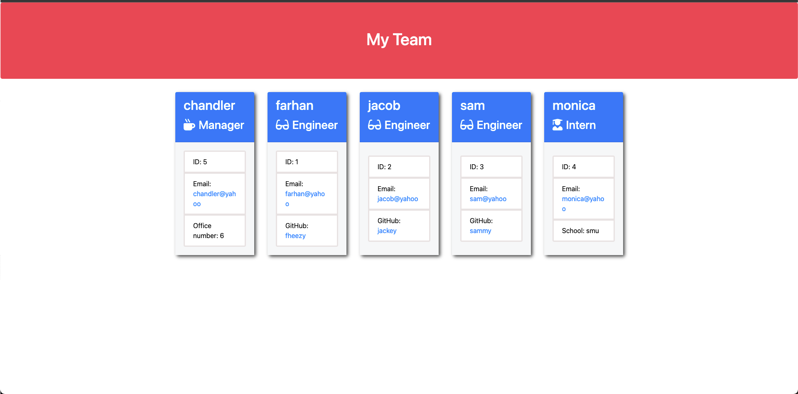

# Team-Profile.CO-Generator
                                                                                                                                                                                                                                                                    
# Description 

Welcome to the Team Profile.Co Generator !

This application is focused on object-oriented programming, using Node.js it takes the information of an employee(s) in a software engineer team then generates it into a HTML
webpage. Displaying information for each employee given. 

## Table of Contents 
- [Team-Profile.Co-Generator](#team-profileco-generator)
- [Description](#description)
- [Table-of-Contents](#table-of-contents)
- [User-Story](#user-story)
- [Mock-Up](#mock-up)
- [Technologies](#technologies)
- [Installation](#installation)
- [Usage](#usage)
- [Contributing](#contributing)
- [Test](#test)
- [Questions](#questions)
- [License](#license)
- [Badge](#badges)

## User Story 

~~~
AS A manager
I WANT to generate a webpage that displays my team's basic info
SO THAT I have quick access to their emails and GitHub profiles
~~~

## Mock-Up

## Technologies 

HTML, CSS, Markdown, JavaScript, Node.js, Jest, Inquirer

## Installation 

Personally used VSCode, check out my [Github](https://github.com/fheezy/Team-Profile.CO-Generator) to pull my code and be able to deploy it yourself !

## Usage 

You can use this [video](https://drive.google.com/file/d/1sLjpFQjlc0bDqLuiYoGGrA2EKkaZ6L5m/view) i made to learn how to start the application. 

## Contributing 

It was i that contributed, visit my [Github](https://github.com/fheezy) !

## Test 

Testing 

## Questions 

If you have any questions, you can contact me using the following links:

| Contact | Description |
| --- | --- |
| Name | Farhan |
| Occupation | Developer |
| Linkedin | <www.linkedin.com/in/farhan-hoque-3bbb75226> |
| GitHub | <https://github.com/fheezy/> |

## License 
MIT License

Copyright (c) 2022 Farhan Hoque

Permission is hereby granted, free of charge, to any person obtaining a copy
of this software and associated documentation files (the "Software"), to deal
in the Software without restriction, including without limitation the rights
to use, copy, modify, merge, publish, distribute, sublicense, and/or sell
copies of the Software, and to permit persons to whom the Software is
furnished to do so, subject to the following conditions:

The above copyright notice and this permission notice shall be included in all
copies or substantial portions of the Software.

THE SOFTWARE IS PROVIDED "AS IS", WITHOUT WARRANTY OF ANY KIND, EXPRESS OR
IMPLIED, INCLUDING BUT NOT LIMITED TO THE WARRANTIES OF MERCHANTABILITY,
FITNESS FOR A PARTICULAR PURPOSE AND NONINFRINGEMENT. IN NO EVENT SHALL THE
AUTHORS OR COPYRIGHT HOLDERS BE LIABLE FOR ANY CLAIM, DAMAGES OR OTHER
LIABILITY, WHETHER IN AN ACTION OF CONTRACT, TORT OR OTHERWISE, ARISING FROM,
OUT OF OR IN CONNECTION WITH THE SOFTWARE OR THE USE OR OTHER DEALINGS IN THE
SOFTWARE.

## Badges 

